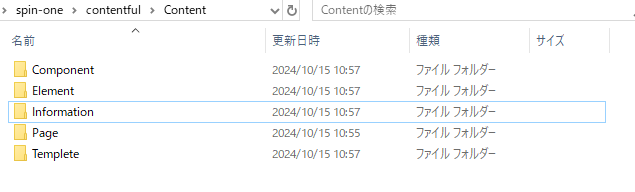

# CONTENT

[登録の流れ](../Import/readme.md)

コマンドで content フォルダの html ファイルを contentful のスペースの`Content`に登録を行います。
前提として ContentModel と Media 情報をスペースに登録しておく必要があります。

<https://github.com/spin-dd/spin-one/issues/13>

## ENV ファイルの設定

登録するために下記の情報を env ファイルから取得します。

| 変数名                      | 入力内容                                        |
| --------------------------- | ----------------------------------------------- |
| CONTENTFUL_SPACE_ID         | スペース ID を入力                              |
| CONTENTFUL_ACCESS_TOKEN     | CMA アクセストークンを入力                      |
| CONTENTFUL_MANAGEMENT_TOKEN | Content Delivery API - access token             |
| ENVIROMENT_ID               | Environment ID を入力(未入力なら master とする) |

`CONTENTFUL_SPACE_ID`に該当するスペースの
`ENVIROMENT_ID`に該当するスペースに content を新規登録します。

## CONTENT ファイルの登録

<https://github.com/spin-dd/spin-one/issues/30>
以下の[contentmodel](../ContentModel/index.md)をプログラムで登録します。

Contentful > Content ディレクトリに下記フォルダを登録します。

- Component
- Element
- Image
- Page
- Templete
- Information



## Component の登録

Contentful > Content > Component ディレクトリに
html ファイルを配置し、ファイルごとに登録します。

### `name`の設定

html ファイル名を`name`として登録します

### `moduleName`の設定

html ファイルの開始タグに`data-component-module-name`に moduleName を定義する

### `props`の設定

html ファイルの開始タグに`data-component-props`に string で JSON object を定義する

### body

HTML ファイルの内容を body とする

```html
<div
  data-component-module-name="{moduleName}"
  data-component-props='{"title":"string","date":"Date","num":"number"}'
>
  内容
</div>
```

## Element の登録

component から`moduleName`,`props`を除いたものを element として扱います。

```html
{body}
```

## Image の登録

※事前に Media に画像情報をアップロードする必要があります。
Media に登録したイメージファイル(.jpg .png ファイルなど)のリンクを取得して表示します。

Contentful > Content > Image ディレクトリに html ファイルを置きます。

```html

```

### name

html ファイル名

### moduleName

data-moduleName に定義します。

### body(画像リンク)

Media に登録された画像の URL を Body とします。

### props

`data-moduleName`,`src`を除く属性を`props`とします。

## Page の登録

Page ディレクトリの html ファイルを取得します。
ディレクトリのパスから`pagePath`を定義します。
html の内容から`head`,`body`,`script`の内容を取得します。

下記の content を事前に登録します。

- Component
- Element
- Image

### pagePath の定義

Page ディレクトリから相対パスで取得します。
index.html は""として扱います。

例

- Page>index.html の html ファイルは"/"として登録
- Page>about>info.html の html ファイルは"/about/info"として登録

### head の定義

html ファイルから head タグから RichText で登録します`<head>{Rich Text}</head>`

### body の定義

html ファイルから body タグから RichText で登録します`<body>{Rich Text}</body>`

### script の定義

html ファイルから script タグから RichText で登録します`<script>{Rich Text}</script>`
