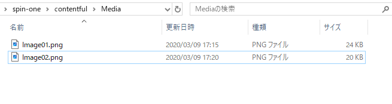

# Media の登録

Media フォルダに画像を配置し、コマンド実行で contentful にアップロードします。
[登録の流れ](../Import/readme.md)

## イメージファイルの登録

.jpg.png ファイル等の画像ファイルを contentful の Media に登録します。

画像ファイルを下記ディレクトリに配置します。
contentful > Media

## 登録情報

- title: ファイル名を登録します。
- file: 画像情報を登録します。
