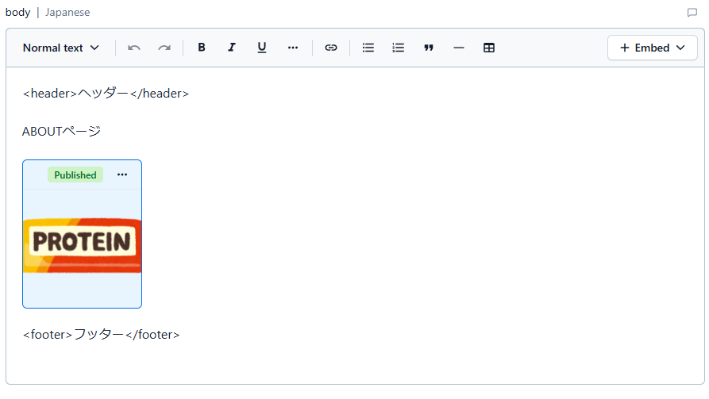

# Imageコンポーネント

Contentful > MEDIA 上にアップロードした画像ファイルの表示に利用します。

contentful > Page のデータで添付画像のように bodyに挿入された画像が対象になります。

アセットのDocument
<https://www.contentful.com/developers/docs/references/content-delivery-api/#/reference/assets>

## props情報

|key|type|必須|備考|
|---|----|----|
|data| any | 〇 |
|width|`number string`| × |
|height|`number string`| × |

## 画像の判別

contentfulのRichTextの内容から挿入画像を探して変換対象にします。

richTextをhtmlに変換する際に
`node.nodeType === "embedded-asset-block"`かつ`node.data.target.sys.linkType === "Asset"`であればアセットデータなので表示対象とする。
`porps.data`に`node.data`をセットしてコンポーネントに変換する

## 画像表示

assetデータを`<image>`タグで表示されるようにします。

- `data.body`から`src`をセット
- `data.id`から`key`をセット
- `data.name`から`alt`をセット
- `props.width`から`width`をセット
- `props.height`から`heigth`をセット
