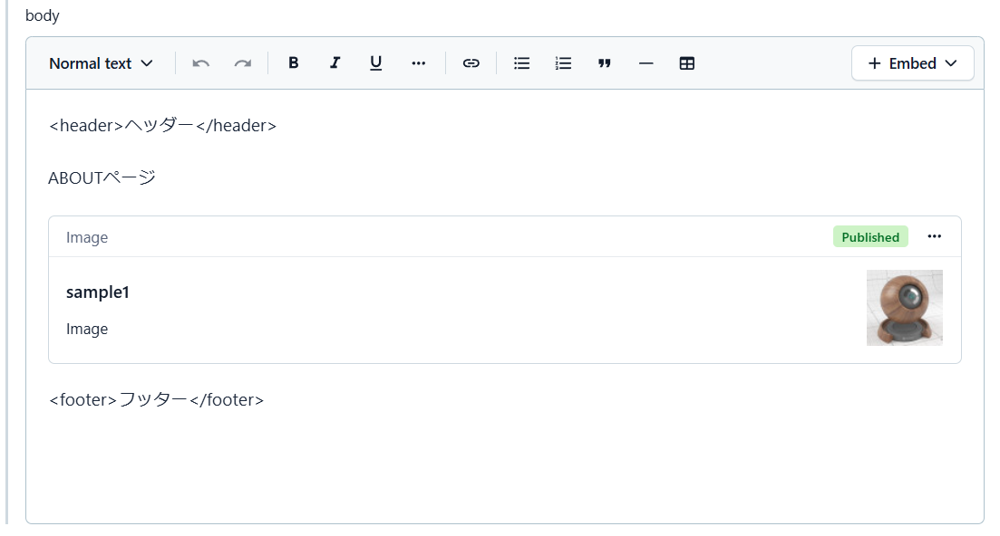

# Imageコンポーネント

Page contentに Image contentを挿入した時に画像を表示できるようにします。

Contentful > MEDIA 上にアップロードします。
Contentful > Content > Image でMediaに登録した画像を指定して作成します。

contentful > Page のデータで添付画像のように bodyに挿入された画像が対象になります。

アセットのDocument
<https://www.contentful.com/developers/docs/references/content-delivery-api/#/reference/assets>

## Image Content の登録

contentfulに contenttype：Imageの登録する

- `name`に任意の文字列を入力
- `moduleName`に`Image`と入力
- `props`にwidthやheight等の情報を入力(任意)
- `body`にMedia上の画像を添付する

### Image Contentの props 情報

|key|type|必須|備考|
|---|----|----|----|
|width|`number string`| × | widthを指定 |
|height|`number string`| × | heightを指定 |

## 画像の判別

contentfulのRichTextの内容から挿入画像を探して変換対象にします。

richTextをhtmlに変換する際に
`node.nodeType === "embedded-asset-block"`から`attribs.data-custom-module-name === "Image"`であればImageのContentとなるので表示対象とする。

## 画像表示

取得した Image Contentデータを``タグで表示されるようにします。

- `data.body`から`src`をセット
- `data.id`から`key`をセット
- `data.name`から`alt`をセット
- `props.width`から`width`をセット
- `props.height`から`heigth`をセット
