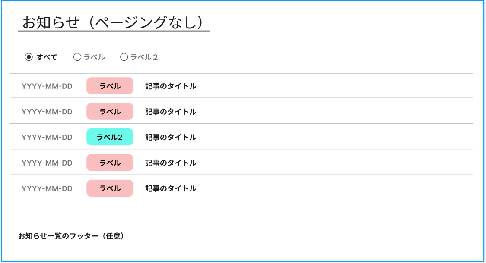
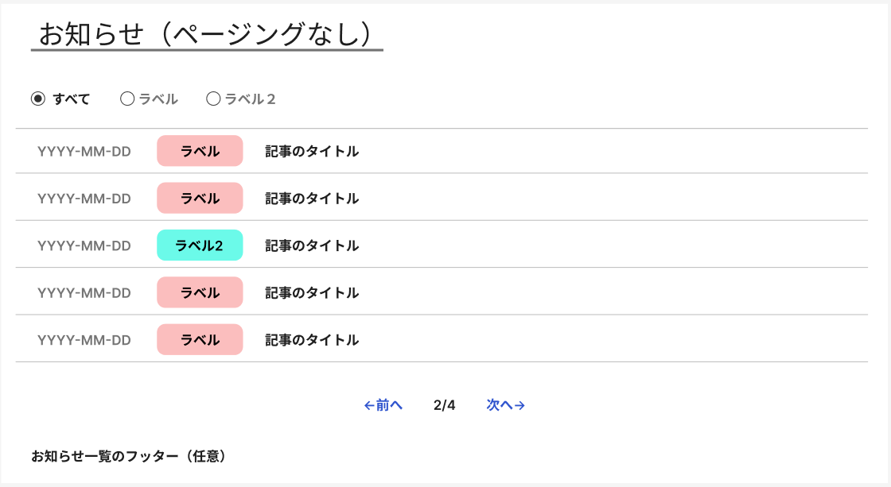

# インフォメーションリストコンポーネント

[Information](../../Contentful/ContentModel/model.md) に投稿した記事を
一覧表示・絞込・記事情報の表示を行います。

## contentful の埋め込み

Gatsby プロジェクト上で Html ファイルに`data-component="infomation-list"`があれば`<InformationList>`に変換します。
`data-props`に「props のパラーメタ」の指定をします。

以下「news」ラベルを指定して

```html
<div
  data-component="infomation-list"
  data-props='{"label":["news"],"item_number":5,canPaging:true}'
>
  {compoent内容}
</div>
```

## props のパラーメタ

| key | 必須 |初期値 | 内容 |
| --- | --|------ | ---- |
|label|〇||information の表示 label を絞り込む|
|item_limit|×|5|ページごとに表示する件数|
|canPaging|×|false|ページングが必要な場合`true`とする|

## 機能

以下の機能を持ちます。

- 一覧表示機能
- 絞込検索機能
- 表示件数の指定
- ページング機能
- 記事表示機能

### 一覧表示機能

- information モデルに登録した content を graphql で取得します。
- `label`ごとに絞り込みを行うことができます。
- 一覧に`title`を記事見出しに表示できます。
- 一覧表示はリストで表示します。
- 記事見出しをクリックすると画面遷移「記事の詳細」(./{slug})に遷移します。
- `canPaging==true`であればページングができる

### 絞込検索機能

- ラベルで絞り込み

ラベル情報を`string[]`で指定してcomponentに渡します。
propsのパラメータに依存します。

### 表示件数の指定

- `item_limit`の数字に応じた件数を表示します。
- 指定なしの場合は 10 件表示します。

### ページング機能

`canPaging==true`のときページングが可能になります。

- 最終ページ以外で「次へ」ボタンを表示する。クリックすると次の{item_limit}件を表示
- 初期ページ以外で「前へ」ボタンを表示する。クリックすると前の{item_limit}件を表示
- 現在のページ/総ページ の合計を表示
- 総ページは{合計/item_limit}で計算する

## 画面イメージ

Figmaでイメージを作成
<https://www.figma.com/design/k6ilowgOY6vlTV7bzZAznV/SPIN-ONE?node-id=0-1&t=6rMjAs9Rr0qsRZrX-1>

- ページングなし
- 5件の表示



- ページングあり
- 5件の表示


