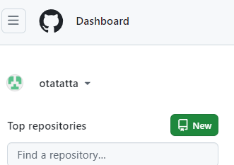
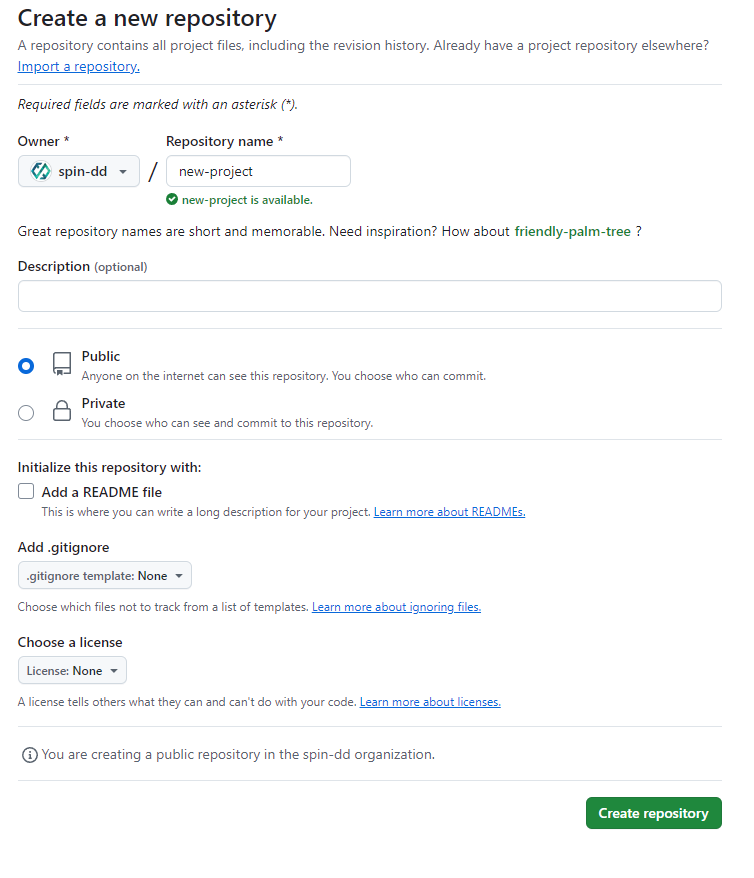
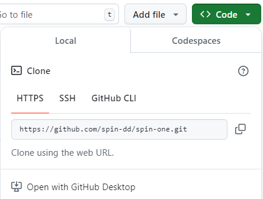
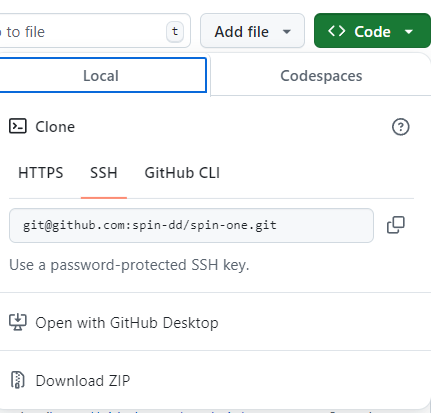

# プロジェクトの初期化

新規プロジェクトを作成し、spin-one レポジトリを clone して作成したレポジトリに push します。

## github に新規プロジェクトを作成

[github](https://github.com/)上にプロジェクトを新規作成します。

github のダッシュボードから[New](https://github.com/new)ボタンをクリックして新規レポジトリ画面に遷移します。

`Initialize this repository with a README`の部分をチェックせずに`Create repository`を行います。

## github のリモートリポジトリ情報をローカルリポジトリに追加する

`gatsby new {任意のディレクトリ名} git@github.com:spin-dd/spin-one.git`
で作成したディレクトリに遷移します。

新規作成レポジトリの remote URL を確認します。(https/ssh どちらでも可)

新規作成したレポジトリに spin-one プロジェクトを push します。
`git remote add origin {新規作成レポジトリの remote URL}`

`git push --set-upstream origin master`で push されることを確認します。
